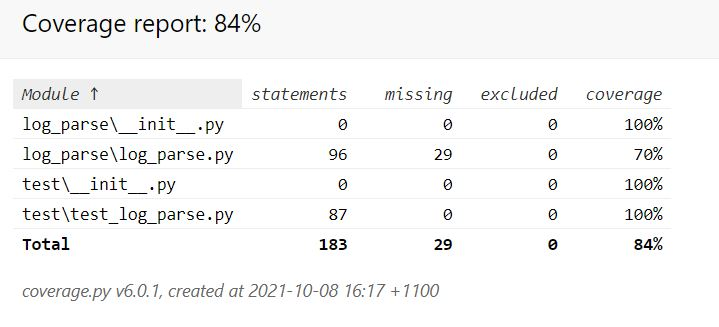

# Results

## Running with the sample-data.log file

```bash
python .\log_parse\log_parse.py --log-file 'sample-data.log'

Top 3 URLs:
-----
(2) - /docs/manage-websites/
(1) - /intranet-analytics/
(1) - http://example.net/faq/


Top 3 IPs:
-----
(4) - 168.41.191.40
(3) - 177.71.128.21
(3) - 50.112.00.11


Unique IPs:
-----
168.41.191.34
168.41.191.40
168.41.191.41
168.41.191.43
168.41.191.9
177.71.128.21
50.112.00.11
50.112.00.28
72.44.32.10
72.44.32.11
79.125.00.21
```

## Test Results

```bash
python -m unittest discover

----------------------------------------------------------------------
Ran 14 tests in 0.010s

OK
```

## Code Coverage


> Remaining 30% coverage for `log_parse\log_parse.py` relates to printing results to STDOUT via `gen_output()` and the `main()` function.